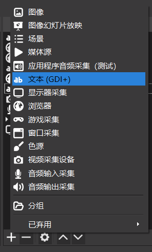
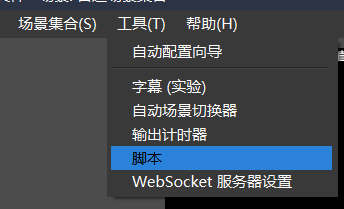
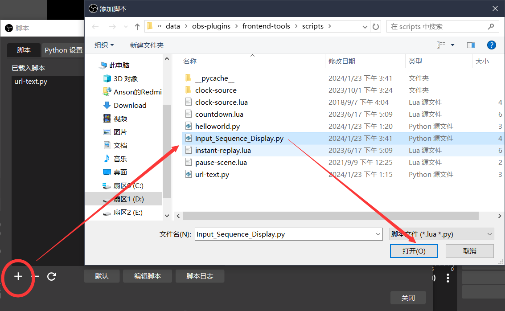
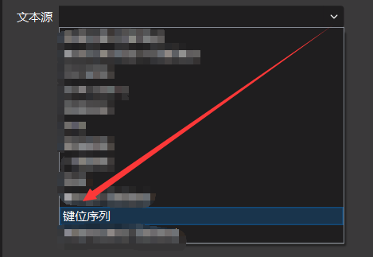
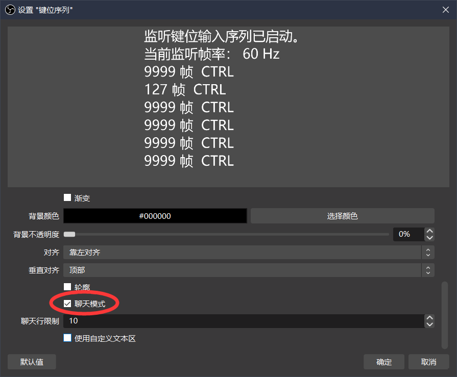

# Input-Sequence-Display
一个在OBS内以滚动序列形式显示用户键盘输入的脚本。A script that displays the user's keyboard input in a scrolling sequence within OBS.

## 使用教程：

1. 下载获取脚本文件Input_Sequence_Display.py，Clone仓库亦或者只是手动复制粘贴源代码均可。为了方便管理，建议将脚本文件存放在OBS的默认脚本存放路径中（..\obs-studio\data\obs-plugins\frontend-tools\scripts）
2. 启动OBS，在场景中添加一个文本源

    

3. 在OBS顶部工具栏中由“工具”栏进入“脚本”。请事先安装Python环境，这部分不包含在本指引内。如果您不会安装Python，请查阅[Python安装教程](https://cnm.buhuibaidu.me/?s=Python%20%E5%AE%89%E8%A3%85)

    

4. 安装Pynput库，如果您的计算机上已经安装过了此库可以略过此步骤。使用`Win`+`R`组合快捷键打开“运行”窗口输入`cmd`，或是用其他您更加惯用的方式启动命令提示符。在弹出的控制台窗口中输入`pip install pynput`以安装Pynput库。出现“Successfully installed pynput”等字样即为安装成功。

    
   
5. 在脚本窗口的左下角点击“添加脚本”图标

    

6. 在右侧配置区域选择此文本源以将脚本和文本源绑定在一起，然后关闭脚本窗口返回OBS主界面

    

7. 在来源编辑器中点击“设置”以编辑文本源，在弹出的编辑窗口中勾选“聊天模式”复选框

    

8. 按照你的需求自行编辑文本源的其他项目。如果需要在不重启OBS的前提下将序列显示重置回初始状态，请在“脚本”工具窗口左下角点击“重新载入脚本”图标

## 其他说明：

计时器用的是time库的time_ns()函数，计时精度为纳秒量级，百分之一秒左右的工作场景下不能说绰绰有余而是杀鸡用牛刀。开发此脚本时我本地工作环境的Python版本是3.10。time.time_ns()函数应该是3.7版本引入，因此在您的电脑上部署时理论需要的最低Python版本即为Python3.7。

默认配置每秒钟计为60帧，超时等待5秒钟没有有效键位输入就计为9999帧。OBS内的脚本配置区除了链接文本源没做任何其他自定义。如果需要自定义这两个数值以及自定义其他内容（例如哪些键位输入操作会视为有效输入）请自己改.py文件。

相关的库是pynput，如有需求请自行查阅开发文档。本脚本默认的监听键位主要服务于我玩《泰坦陨落2》常用的几个键位，需要监听别的键位输入请参考pynput的开发文档自己改代码。考虑到只需要监听特定键位且有转换输出的需求因而采用了逐个if的土办法，甚至没有用swich。本来想用字典映射的，但不知为何on_press(key)在按下不同类型的键时返回的键值类型不统一，遂作罢。如果需要监听键盘上所有键位，三个单引号括起来的else部分即为监听一切键盘操作并将键位转化为大写输出在屏幕上。

在pynput库中特定功能键按下时按别的键算作组合键，例如ctrl+W是\x17，写代码时注意一下组合键的问题。

----

The English version is directly translated from Chinese, so I cannot guarantee that the interface text shown in the guide is the same as the actual English version of the OBS interface text.

## Usage:

1. Download the script file Input_Sequence_Display.py, no matter you want to Clone the repository or just copy and paste the source code manually. For ease of management, it is recommended to store the script file in the default script storage path of OBS (..\obs-studio\data\obs-plugins\frontend-tools\scripts).
2. Start OBS and add a text source to the scene.
3. Click on "Tools" in the toolbar at the top of OBS, then click on "Scripts". Please install the Python environment beforehand, this part is not included in this guide. If you don't know how to install Python, Use The Fxxking Google.
4. Install the Pynput library, or skip this step if it is already installed on your computer. Use the `Win` + `R` shortcut to open a Run window and type `cmd`, or launch a Command Prompt in a way you are more comfortable with. In the console window, type `pip install pynput` to install the Pynput library. The message "Successfully installed pynput" will appear to indicate a successful installation.
5. Click the "Add Script" icon in the lower left corner of the Scripts window.
6. Select the text source in the right configuration area to bind the script to the text source, and then close the Scripts window to return to the main OBS interface.
7. In the source editor, select the text source you just bind and right-click the source and "Settings" to edit the source, then click the "Chat Mode" checkbox in the pop-up editing window.
8. Edit other items of the text source according to your needs. If you need to reset the sequence display back to its default state without restarting OBS, please click the "Reload Script" icon in the lower left corner of the "Scripts" tool window.

## Other notes:

The timer uses the "time" library's time_ns() function, which has nanosecond precision, more than enough for hundredths of a second work scenarios. The version of Python in my local development environment at the time of developing this script was 3.10. It is possible that the time.time_ns() function was introduced in ver3.7, so the minimum version of Python required for deployment on your computer is Python 3.7.

The default configuration is 60 frames per sec, with a timeout of 9999 frames after 5 seconds of no valid key input detected. The script configuration area within OBS is not customized in any way other than linking to a text source. If you want to customize these two values and other things (e.g. which key input are considered valid), please change the .py file by yourself.

The relevant library is Pynput, please check the development documentation if you need. The default list of keys to listen to in this script mainly serves a few keys when I'm playing Titanfall 2. If you need to listen to other key inputs, please refer to pynput's development doc to edit the code by yourself. Considering that I only need to listen to specific keys and have the need to convert the output text, I choose the if-by-if approach, not swich statements. At first I was considering dictionary mapping, but for some reason on_press(key) doesn't return the same type of key value when different types of keys are pressed, so I gave up. If you need to listen to all the keys on the keyboard, the "else" part enclosed in three single quotes listens to all keyboard operations and converts the keys to uppercase for output on the screen.

In the pynput library, pressing a specific function key and then pressing another will count as a key combination, e.g. ctrl+W is \x17, so pay attention to key combinations when coding.
